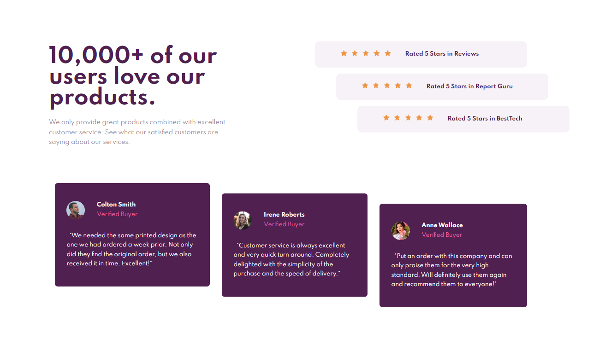

# social-proof-section-master

This is a solution to front-end mentor challenge <a href="https://www.frontendmentor.io/challenges/social-proof-section-6e0qTv_bA">Social proof section</a> 
I have done another frontendmentor challenge recently, this time I made it so much faster, than the previous one. I am progressing.  
Website was made in HTML/CSS(SCSS) soon in JS.  
The website is adapted to be well-visible at desktop and mobile phones.

<h2>Desktop view</h2>

 
<h2>Mobile view</h2>

